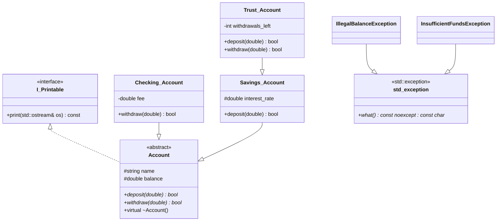

# Polymorphic Banking System


## 📖 Overview

A compact **financial system simulation** that demonstrates modern C++ **Object-Oriented Design**:  
**Runtime Polymorphism**, a clean **Printable** interface for uniform streaming, **RAII** with smart pointers, and **custom exceptions** for robust error handling.

---

## 🏗️ System Architecture (UML)

The diagram shows the inheritance and interface relationships.  
`Trust_Account` specializes `Savings_Account`: it inherits interest logic and adds stricter rules.



---

## 🚀 Business Logic & Rules

### 1. `Account` (Abstract Base)
- **Role:** Defines the contract (`deposit`, `withdraw`) for all accounts.
- **Safety:** Construction with a negative starting balance throws `IllegalBalanceException`.

### 2. `Savings_Account`
- **Base:** Inherits from `Account`.
- **Logic:** Adds interest (%) to each deposit.  
  _Formula:_ `amount += amount * (interest_rate / 100.0)` then deposit.

### 3. `Checking_Account`
- **Base:** Inherits from `Account`.
- **Logic:** Applies a fixed **transaction fee** (e.g., `$1.50`) on every withdrawal.

### 4. `Trust_Account`
- **Base:** Inherits from `Savings_Account`.
- **Bonus:** Deposits over **$5000** earn a **$50** bonus.
- **Restrictions:** Up to **3 withdrawals/year**; each withdrawal ≤ **20%** of current balance.
- **Safety:** Violations throw `InsufficientFundsException`.

---

## 🛠️ Technical Concepts

- **Dynamic Polymorphism:** `std::vector<std::unique_ptr<Account>>` with virtual calls at runtime.
- **Interface Segregation:** `I_Printable` decouples printing from domain logic; a single `operator<<` works for all printables.
- **RAII:** `std::unique_ptr`/`std::make_unique` (no raw `new`/`delete`).
- **Exception Safety:** Clear throw points; catch via `const std::exception&`, messages via `what()`.

---

## 📂 Project Structure

```text
Polymorphic-Banking-System/
├── Account.h / .cpp                // Abstract base
├── Savings_Account.h / .cpp        // Derived
├── Checking_Account.h / .cpp       // Derived
├── Trust_Account.h / .cpp          // Derived from Savings_Account
├── I_Printable.h                   // Interface (pure abstract)
├── IllegalBalanceException.h       // Custom exception (std::exception)
├── InsufficientFundsException.h    // Custom exception (std::exception)
└── main.cpp                        // Driver (polymorphic vector)
```

---

## 💻 Usage Example

```cpp
try {
    std::vector<std::unique_ptr<Account>> accounts;
    accounts.push_back(std::make_unique<Checking_Account>("Ran", 2000));
    accounts.push_back(std::make_unique<Trust_Account>("Boss", 10000, 5.0));

    for (const auto& acc : accounts) {
        acc->withdraw(500);               // dynamic dispatch
        std::cout << *acc << std::endl;   // I_Printable → operator<< → print()
    }
}
catch (const std::exception& ex) {
    std::cerr << "Transaction Failed: " << ex.what() << std::endl;
}
```

---

## 🔧 Build

**g++ (single TU example):**
```bash
g++ -std=c++17 -O2 -Wall -Wextra -Werror \
  Account.cpp Savings_Account.cpp Checking_Account.cpp Trust_Account.cpp main.cpp \
  -o demo
./demo
```

**CMake (recommended):**
```cmake
cmake_minimum_required(VERSION 3.15)
project(PolymorphicBankingSystem CXX)
set(CMAKE_CXX_STANDARD 17)
add_executable(demo
  Account.cpp Savings_Account.cpp Checking_Account.cpp Trust_Account.cpp main.cpp
)
if (CMAKE_CXX_COMPILER_ID MATCHES "GNU|Clang")
  target_compile_options(demo PRIVATE -Wall -Wextra -Werror)
endif()
```

---

## 👤 Author

**Ran Almagor**  
Computer Science Graduate & C++ Developer
