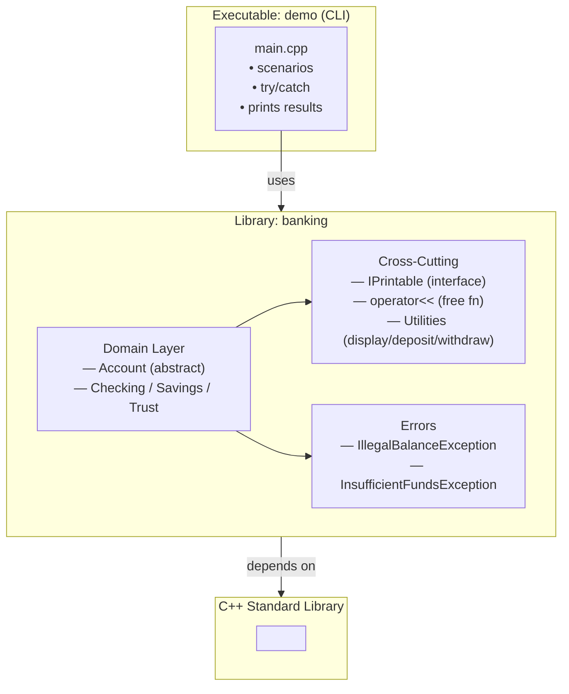
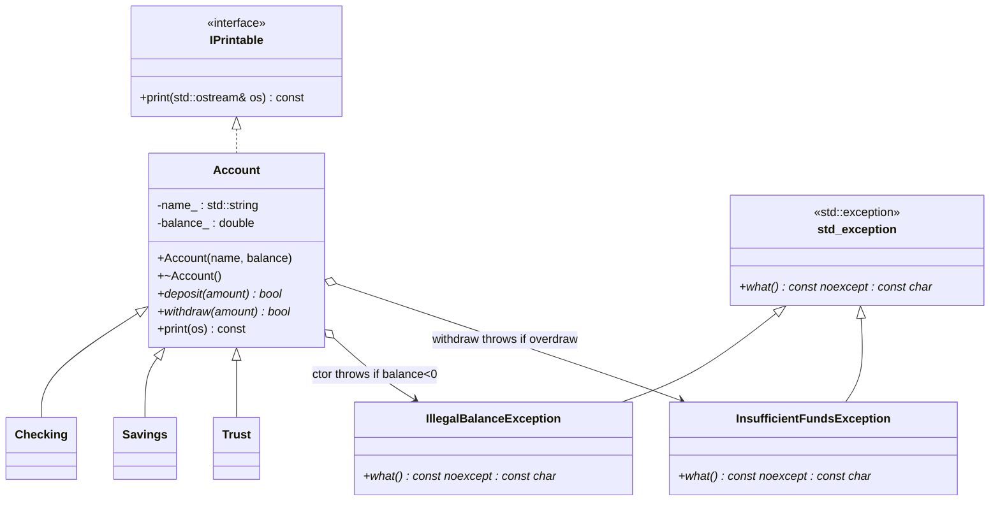

# Polymorphic-Banking-System

> A cohesive C++ project that demonstrates a clean **object‑oriented banking model** with
> **runtime polymorphism**, a **Printable interface** for uniform streaming, and **exception‑safe design**.

<p align="center">
  
  
  
  
</p>

---

## Table of Contents
- [Overview](#overview)
- [Design Goals](#design-goals)
- [Key Features](#key-features)
- [Architecture](#architecture)
  - [System Architecture (Mermaid)](#system-architecture-mermaid)
  - [UML — Classes & Exceptions (Mermaid)](#uml--classes--exceptions-mermaid)
- [Exceptions & Invariants](#exceptions--invariants)
- [Build & Run](#build--run)
- [Project Structure](#project-structure)
- [Usage Examples](#usage-examples)
- [Testing Ideas](#testing-ideas)
- [Engineering Notes](#engineering-notes)
- [Limitations & Next Steps](#limitations--next-steps)
- [License](#license)

---

## Overview
**Polymorphic-Banking-System** models a compact banking domain and presents a **polymorphic, interface‑driven design** hardened with **custom exceptions**. It demonstrates how to:
- Use **abstract classes** as **interfaces** (idiomatic C++; no `interface` keyword).
- Provide **uniform streaming** (`std::cout << obj`) via a `Printable` interface and a **free** `operator<<`.
- Enforce domain **invariants** using **exceptions** that derive from `std::exception` and override `what() noexcept`.
- Keep the codebase **small, readable, and testable**, with clear extension points.

---

## Design Goals
- **Clarity over cleverness:** readable abstractions and predictable behavior.
- **Strong object semantics:** dynamic dispatch where it matters; consistent streaming via an interface.
- **Safety:** exception-aware constructors and operations; RAII; no manual resource ownership.
- **Extensibility:** add new account types or non‑account printables without changing existing clients.

---

## Key Features
- **Polymorphic account model:** `Account` (abstract) → `Checking`, `Savings`, `Trust`.
- **Printable interface:** `IPrintable` + `operator<<` → dynamic dispatch to `print(std::ostream&) const`.
- **Custom exceptions:**  
  - `IllegalBalanceException` — thrown on negative initial balance.  
  - `InsufficientFundsException` — thrown when a withdrawal would overdraw.
- **Polymorphic containers:** idiomatic use of `std::unique_ptr`/`std::shared_ptr` for ownership.
- **Utilities:** unified `display`, `deposit_all`, `withdraw_all` operating on base‑class pointers.

---

## Architecture

### System Architecture (Mermaid)
> GitHub renders Mermaid directly — no external images required.



### UML — Classes & Exceptions (Mermaid)


> Notes: `deposit/withdraw` are **pure virtual** (may provide shared base definitions).  
> A **virtual destructor** is provided.

---

## Exceptions & Invariants
- **Invariant:** Accounts must **never** start or end with negative balances.
- **Throw points:**
  - `Account(name, balance)` → throws **IllegalBalanceException** if `balance < 0`.
  - `Account::withdraw(amount)` → throws **InsufficientFundsException** if `balance - amount < 0`.
- **Handling:** Catch by reference (`const std::exception&`) at boundaries; log via `what()`.

---

## Build & Run

### Quick demo (single TU)
```bash
g++ -std=c++17 -O2 -Wall -Wextra -Werror \
    src/main.cpp src/Account.cpp src/Checking.cpp src/Savings.cpp src/Trust.cpp \
    -I include -o demo
./demo
```

### CMake (recommended)
```cmake
cmake_minimum_required(VERSION 3.15)
project(PolymorphicBankingSystem CXX)
set(CMAKE_CXX_STANDARD 17)
set(CMAKE_CXX_STANDARD_REQUIRED ON)

add_library(banking
    src/Account.cpp
    src/Checking.cpp
    src/Savings.cpp
    src/Trust.cpp
    src/util.cpp
    # src/exceptions.cpp  # optional if implemented inline in headers
)
target_include_directories(banking PUBLIC include)

add_executable(demo src/main.cpp)
target_link_libraries(demo PRIVATE banking)

if (CMAKE_CXX_COMPILER_ID MATCHES "GNU|Clang")
  target_compile_options(banking PRIVATE -Wall -Wextra -Werror)
  target_compile_options(demo    PRIVATE -Wall -Wextra -Werror)
endif()
```

Build:
```bash
mkdir -p build && cd build
cmake .. && cmake --build .
./demo
```

> Tip: add `-fsanitize=address,undefined` during development for diagnostics.

---

## Project Structure
```
Polymorphic-Banking-System/
├─ include/
│  ├─ IPrintable.h
│  ├─ Account.h
│  ├─ Checking.h
│  ├─ Savings.h
│  ├─ Trust.h
│  ├─ util.h
│  ├─ IllegalBalanceException.h
│  └─ InsufficientFundsException.h
├─ src/
│  ├─ Account.cpp
│  ├─ Checking.cpp
│  ├─ Savings.cpp
│  ├─ Trust.cpp
│  ├─ util.cpp
│  └─ main.cpp
├─ CMakeLists.txt
└─ README.md
```

---

## Usage Examples
```cpp
#include <memory>
#include <vector>
#include <iostream>

std::vector<std::shared_ptr<Account>> accts;
accts.emplace_back(std::make_shared<Checking>("Daily", 250.0));
accts.emplace_back(std::make_shared<Savings>("Emergency", 1000.0));
accts.emplace_back(std::make_shared<Trust>("LongTerm", 5000.0));

try {
    auto bad = std::make_shared<Checking>("Oops", -10.0); // throws IllegalBalanceException
} catch (const std::exception& e) {
    std::cerr << e.what() << "\n";
}

for (auto& a : accts) {
    std::cout << *a << "\n";        // IPrintable → operator<< → print()
    a->deposit(100.0);              // virtual dispatch
    try { a->withdraw(9000.0); }    // may throw InsufficientFundsException
    catch (const std::exception& e) { std::cerr << e.what() << "\n"; }
}
```

---

## Testing Ideas
- `deposit(-x)` returns `false`; `withdraw` returns `false`/throws as specified.
- `Account` is **abstract**; attempting to instantiate should fail to compile.
- Single set of utilities works with `std::vector<std::shared_ptr<Account>>` (no slicing).
- `operator<<` dispatches dynamically to derived `print` implementations.
- Run under **ASan/UBSan** to ensure no leaks or UB on failure paths.

---

## Engineering Notes
- **Interfaces via abstract classes** is the idiomatic C++ way to express contracts.
- **Free `operator<<`** keeps streaming natural and decoupled; types just implement `print()`.
- **Rule of 0:** domain classes store standard types; no manual memory management required. If raw resources are added later, evolve to **Rule of 5**.
- **Exceptions:** simple, stable `what()` messages; can be extended to carry contextual info (amount, balance).

---

## Limitations & Next Steps
- Not a production banking system (currency, rounding, persistence are out of scope).
- `double` balances; consider fixed‑point/`decimal` for finance.
- Consider adding interest policies, fees, and a `Ledger` with audit trails.
- Add CI, unit tests (Catch2/GoogleTest), and sanitizer‑enabled builds.

---

## License
Released under the **MIT License**. Use, modify, and distribute with attribution.
