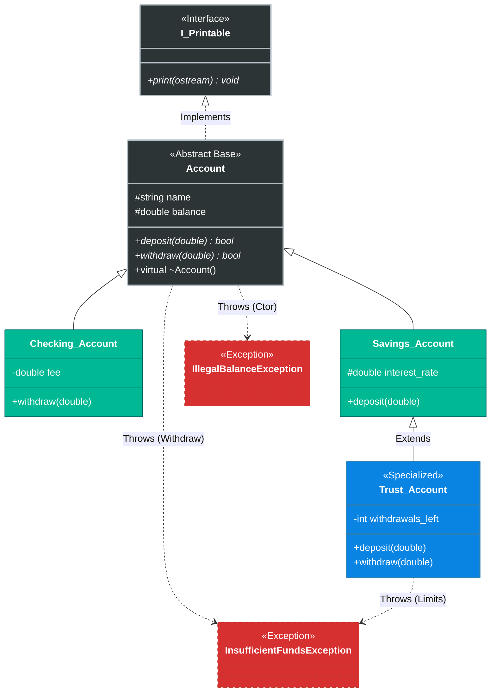

# 🌟 Polymorphic Banking System


> A compact **financial system** in modern C++ that demonstrates **runtime polymorphism**, a clean **Printable** interface for uniform streaming, **RAII** with smart pointers, and **custom exceptions** for robust error handling.

---

## 🧭 Overview

This repository models a small banking domain with multiple account types and clear domain rules.  
The design favors **clarity**, **safety**, and **extensibility**:
- **Abstract base** `Account` with pure-virtual `deposit/withdraw`
- **Interface** `I_Printable` + free `operator<<` → uniform streaming
- **Exceptions** derived from `std::exception` for illegal balance / overdraft
- **Polymorphic containers** using `std::unique_ptr` / `std::shared_ptr`

---

## 🏗️ System Architecture (UML)

The diagram highlights inheritance and interface relationships.  
`Trust_Account` specializes `Savings_Account` (inherits interest logic, adds stricter rules).



---

## 🚀 Business Rules

### 1) `Account` (Abstract)
- **Contract:** `deposit(double)`, `withdraw(double)` (pure virtual).
- **Safety:** Constructing with a negative balance throws **`IllegalBalanceException`**.

### 2) `Savings_Account`
- **Logic:** Adds interest on deposit.  
  _Formula:_ `amount += amount * (interest_rate / 100.0)`.

### 3) `Checking_Account`
- **Logic:** Fixed **transaction fee** (e.g., `$1.50`) on each withdrawal.

### 4) `Trust_Account`
- **Bonus:** Deposits **> $5000** earn an immediate **$50** bonus.  
- **Limits:** Up to **3 withdrawals/year**; each withdrawal ≤ **20%** of current balance.  
- **Safety:** Violations throw **`InsufficientFundsException`**.

---

## 🛠️ Technical Highlights

- **Dynamic polymorphism:** `std::vector<std::unique_ptr<Account>>` with virtual dispatch.
- **Interface segregation:** `I_Printable` decouples streaming from domain logic; one `operator<<` covers all printables.
- **RAII:** Smart pointers (`std::unique_ptr`, `std::make_unique`) — no raw `new`/`delete`.
- **Exception safety:** Clear throw points; catch by `const std::exception&`, report via `what()`.

---

## 📂 Project Structure

```text
Polymorphic-Banking-System/
├── Account.h / .cpp                // Abstract base
├── Savings_Account.h / .cpp        // Derived
├── Checking_Account.h / .cpp       // Derived
├── Trust_Account.h / .cpp          // Derived from Savings_Account
├── I_Printable.h                   // Interface (pure abstract)
├── IllegalBalanceException.h       // Custom exception (std::exception)
├── InsufficientFundsException.h    // Custom exception (std::exception)
└── main.cpp                        // Driver (polymorphic vector)
```

---

## 💻 Usage Example

```cpp
try {
    std::vector<std::unique_ptr<Account>> accounts;
    accounts.push_back(std::make_unique<Checking_Account>("Ran", 2000));
    accounts.push_back(std::make_unique<Trust_Account>("Boss", 10000, 5.0));

    for (const auto& acc : accounts) {
        acc->withdraw(500);               // dynamic dispatch
        std::cout << *acc << std::endl;   // I_Printable → operator<< → print()
    }
}
catch (const std::exception& ex) {
    std::cerr << "Transaction Failed: " << ex.what() << std::endl;
}
```

---

## 👤 Author

**Ran Almagor**  
Computer Science Graduate & C++ Developer
