# 🌟 Polymorphic‑Banking‑System
### **Single Project – Polymorphism • Interface • Exceptions**

A clean C++ mini‑project that models a banking domain with **runtime polymorphism**, a **Printable interface** for uniform streaming, and **exception‑safe** operations.

---

## 🚀 Highlights

- **Abstract base**: `Account` with pure‑virtual `deposit/withdraw`
- **Uniform streaming**: `IPrintable` + free `operator<<` → calls `print(std::ostream&) const`
- **Custom exceptions**:  
  - `IllegalBalanceException` (negative initial balance)  
  - `InsufficientFundsException` (overdraft on withdraw)
- **RAII & safety**: No raw ownership; clear throw points; catch via `std::exception`
- **Polymorphic containers**: `std::unique_ptr` / `std::shared_ptr` of `Account`

---

## 📦 Core Interfaces (Headers)

```cpp
// IPrintable.h
struct IPrintable {
    virtual void print(std::ostream& os) const = 0;
    virtual ~IPrintable() = default;
};
std::ostream& operator<<(std::ostream& os, const IPrintable& rhs);  // calls rhs.print(os)
```

```cpp
// Account.h
class Account : public IPrintable {
protected:
    std::string name_;
    double balance_ {};
public:
    Account(std::string name, double balance);
    virtual ~Account() = default;

    virtual bool deposit(double amount) = 0;
    virtual bool withdraw(double amount) = 0;

    double balance() const noexcept { return balance_; }
    const std::string& name() const noexcept { return name_; }

    void print(std::ostream& os) const override; // common info; derived types add specifics
};
```

```cpp
// Checking.h / Savings.h / Trust.h  (derive from Account)
// • Override deposit/withdraw as needed
```

```cpp
// Exceptions
struct IllegalBalanceException : std::exception {
    const char* what() const noexcept override { return "Illegal initial balance"; }
};
struct InsufficientFundsException : std::exception {
    const char* what() const noexcept override { return "Insufficient funds"; }
};
```

---

## 🧠 Design Principles
- **Interfaces via abstract classes** (idiomatic C++)
- **Free `operator<<`** decouples streaming from ownership; prevents slicing
- **Small surface area**: minimal API, clear invariants
- **Rule of 0**: standard types only; easy to evolve to Rule of 5 if needed

---

## 📝 Usage Example

```cpp
std::vector<std::shared_ptr<Account>> accts;
accts.emplace_back(std::make_shared<Checking>("Daily", 250.0));
accts.emplace_back(std::make_shared<Savings>("Emergency", 1000.0));
accts.emplace_back(std::make_shared<Trust>("LongTerm", 5000.0));

try {
    auto bad = std::make_shared<Checking>("Oops", -10.0); // throws IllegalBalanceException
} catch (const std::exception& e) {
    std::cerr << e.what() << "\n";
}

for (auto& a : accts) {
    std::cout << *a << "\n";        // IPrintable → operator<< → print()
    a->deposit(100.0);
    try { a->withdraw(9000.0); }    // may throw InsufficientFundsException
    catch (const std::exception& e) { std::cerr << e.what() << "\n"; }
}
```

---

## 🗂️ Project Structure (suggested)
```
Polymorphic-Banking-System/
├─ include/
│  ├─ IPrintable.h
│  ├─ Account.h
│  ├─ Checking.h
│  ├─ Savings.h
│  ├─ Trust.h
│  ├─ IllegalBalanceException.h
│  └─ InsufficientFundsException.h
├─ src/
│  ├─ Account.cpp
│  ├─ Checking.cpp
│  ├─ Savings.cpp
│  ├─ Trust.cpp
│  └─ main.cpp
├─ CMakeLists.txt
└─ README.md
```

---

## 🏗️ Architecture (Mermaid)
> GitHub renders Mermaid diagrams directly in Markdown.

```mermaid
flowchart TB
  %% Polymorphic-Banking-System — Architecture
  subgraph App["Executable: demo (CLI)"]
    main["main.cpp\n• scenarios\n• try/catch\n• prints results"]
  end

  subgraph Lib["Library: banking"]
    domain["Domain Layer\n— Account (abstract)\n— Checking / Savings / Trust"]
    cross["Cross-Cutting\n— IPrintable (interface)\n— operator<< (free fn)\n— Utilities (display/deposit/withdraw)"]
    errors["Errors\n— IllegalBalanceException\n— InsufficientFundsException"]
  end

  subgraph Std["C++ Standard Library"]
    std["<iostream>   <memory>   <vector>   <exception>"]
  end

  main -->|uses| Lib
  domain --> cross
  domain --> errors
  Lib -->|depends on| Std
```



---

## 🧬 UML — Classes & Exceptions (Mermaid)


---

## 🔧 Build
```bash
g++ -std=c++17 -O2 -Wall -Wextra -Werror \
  src/main.cpp src/Account.cpp src/Checking.cpp src/Savings.cpp src/Trust.cpp \
  -I include -o demo
./demo
```
_or_ CMake as usual.

---

## 🎯 Purpose
Demonstrate a concise, professional grasp of **polymorphism**, **interfaces**, and **exception handling** in C++ with a tidy, easily extendable codebase.
